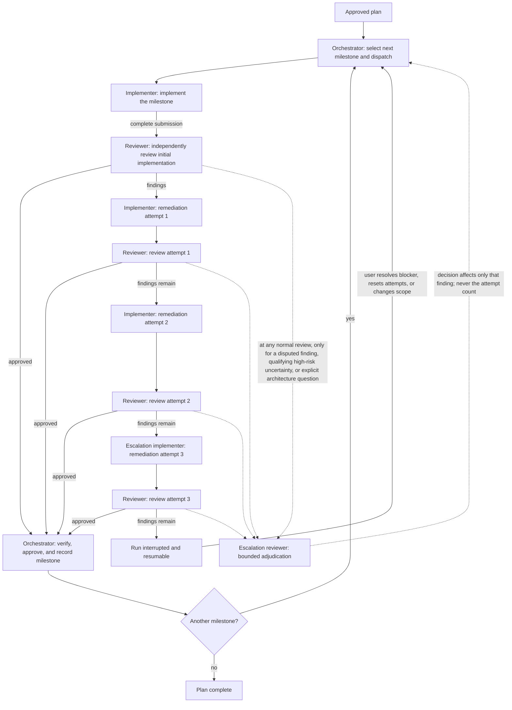

# Milestone supervision process

Use this process whenever a repository plan is implemented milestone by
milestone with an implementer and an independent reviewer. The main agent owns
the process. Implementer and reviewer messages do not themselves change a
milestone's status.

## Milestone ledger

Before work starts, the main agent creates the tracked durable run ledger at
`docs/ai/runs/<plan-basename>.md`, where `<plan-basename>` is the plan filename
without its extension. This is the single resume record for the active plan in
the current worktree. It contains an append-only action log plus one current
milestone ledger entry. The plan's execution log remains a concise append-only
summary of completed milestones; it does not replace the durable run ledger.

The main agent maintains the active milestone ledger with all of the following
fields:

### Run-ledger isolation

**NEVER create, edit, reformat, normalize, or otherwise change a file under
`docs/ai/runs/` outside the specific authorized orchestrated plan run that the
file records.** Unrelated implementation, documentation, cleanup, consistency,
and formatting work must treat every run ledger as read-only, even when its
historical content no longer matches current conventions. A completed run
ledger is immutable because there is no active orchestrated run authorized to
change it. Corrections or new policy belong in the current source plan or
process definition, never in another run's historical record.

The ledger's required Markdown layout, field invariants, checkpoint contents,
transition procedure, and pre-final audit are defined in
[`run-ledger-layout.md`](run-ledger-layout.md). That document is normative for
all files under `docs/ai/runs/`; this process defines the milestone decisions
those ledgers must record.

| Field | Required value |
|---|---|
| Scope checklist | Every explicit scope item, test slice, exit criterion, documentation requirement, and verification command from the plan |
| Status | `implementing`, `reviewing`, `approved`, or `blocked` |
| Review finding set | The complete unresolved findings from the latest reviewer pass, grouped by severity and file/line where available. Assign each finding a stable identity (for example `R1`) when it enters the ledger and retain it across remediation and adjudication. |
| Remediation attempts | Number of *complete remediation submissions* rejected by the reviewer; starts at `0` |
| Implementation tier | `normal` for initial work and remediations while attempts are below `2`; `escalation` only for the remediation started with attempts equal to `2` |
| Evidence | Implementer RED/GREEN evidence, reviewer decision, and main-agent verification results |
| Final response permitted | `no` while the run is active; `yes` only when all milestones are approved or a valid blocked/external-blocked terminal condition is recorded |

Only the main agent writes the durable ledger. It creates a checkpoint before
dispatching a packet and appends a checkpoint after every implementer or
reviewer message, complete-submission decision, review/adjudication decision,
validation command, approval, block, external-blocker decision, or recovery
reconciliation. Each checkpoint records timestamp, actor, action, outcome,
evidence or exact command/result references, resulting milestone state, and
the exact next permitted action. Partial progress is recorded as progress only;
it does not change the attempt counter or the milestone status to complete.

The durable ledger uses this repository-native Markdown structure:

```markdown
# Run ledger — <plan title>

## Run state

- Plan: `<path>`
- State: `active` | `blocked` | `complete`
- Started / last updated: `<timestamps>`
- Active milestone / phase: `<ID and implementing|reviewing|approved|blocked>`
- Resume from: `<exact next permitted action>`
- Final response permitted: `yes` | `no`

## Current milestone ledger

- Scope checklist: `<checked/unchecked items>`
- Implementation tier: `normal` | `escalation`
- Remediation attempts: `<0..3>`
- Finding set: `<stable ID, state, severity, location, evidence>`
- Current packet and evidence: `<references>`
- Verification / adjudication: `<commands, results, decisions>`

## Action log

| Time | Actor | Action | Outcome / evidence | Resulting state and resume instruction |
|---|---|---|---|---|
```

The log is append-only. The current-state sections are updated to reflect the
last appended action; earlier evidence is never silently overwritten.

Finding state is main-agent ledger state. Use the repository's normal finding
terminology where it is already equivalent; otherwise record a finding as
`unresolved`, `accepted`, `disputed`, `resolved`, or `invalidated`. Implementer
and reviewer messages provide evidence only and never directly change a
milestone status or the attempt counter. When escalation review is used, append
an `Escalation review` evidence entry containing the exact finding/question
identity, its decision, and the supporting evidence.

## Interruption and resumption

An interrupted run is not a user-facing stop condition. Before resuming, the
main agent reads the source plan, the durable run ledger, the current worktree
status, and evidence referenced by the latest action. It reconciles a possible
interruption between the last ledger checkpoint and the filesystem—for example,
a completed command or agent change whose result was not yet recorded—then
appends that reconciliation before dispatching more work. It must not infer a
completion, approval, reviewer decision, finding resolution, or remediation
attempt from an incomplete message or unrecorded local change.

For a blocked or external-blocked run, the ledger records the exact blocker,
unresolved finding set, remediation-attempt count, evidence, and conditions for
safe continuation. A resumed run keeps the same ledger and appends a new
checkpoint; it does not erase prior action history.

## Continuous execution mandate

Plan execution is continuous once authorized. A milestone boundary never
returns control to the user: after approval, the main agent records evidence,
creates the next ledger entry, dispatches its implementation packet, and keeps
working. It must not produce a final user-facing response while any milestone
remains unchecked, including while the next milestone is implementing or
reviewing. Brief commentary progress updates do not pause the process.

Normal test failures, review rejections, partial submissions, and approval of
a milestone are internal transitions and never stopping conditions. The normal
stop condition is only the three-rejected-complete-remediation limit. An
external blocker may stop execution only when the main agent cannot safely make
further authorized progress; it must report exact evidence rather than treat
ordinary uncertainty as a blocker.

## Initial implementation cycle

1. The main agent reads the plan, relevant specification sections, current
   code, and repository instructions.
2. It makes the full scope checklist and gives the implementer one complete,
   explicit work packet for the milestone.
3. The implementer uses test-first development for every behavior: add the
   smallest relevant failing test, record why it fails, implement the smallest
   passing change, refactor, and run the milestone quality gates.
4. An implementer message saying that only part of a packet is complete is not
   a completion. The main agent sends the remaining unchecked checklist items
   back to the implementer. It does not request review and does not count an
   attempt.
5. Only when the implementer supplies evidence for every checklist item does
   the main agent mark the status `reviewing` and send the full current
   worktree to the normal read-only reviewer.

## Independent review cycle

1. The reviewer must inspect the current shared filesystem, not rely on a
   prior snapshot or the implementer's description.
2. The reviewer checks the full milestone scope, specification, safety,
   portability, test quality, scope control, and all required verification
   commands. Findings must include severity and a file/line reference when
   practical.
3. If the reviewer approves, the main agent runs the milestone verification
   itself, updates affected documentation/contracts, records the execution-log
   entry, marks the milestone checked, updates the durable ledger, and
   immediately starts the next unchecked milestone.
4. If the reviewer returns findings, the main agent records the entire finding
   set and creates one remediation packet containing every unresolved finding.
   It then returns the status to `implementing`.

## Remediation attempts and the three-attempt limit

An attempt is counted only at this exact boundary:

1. The implementer has addressed **every** item in the current reviewer
   finding set and supplied RED/GREEN evidence plus quality-gate results.
2. The main agent sends that complete submission to the reviewer.
3. The reviewer rejects it with one or more unresolved findings.

At step 3, increment `Remediation attempts` by one. Do not count:

- partial coding slices;
- implementer progress or status messages;
- a test run that precedes a complete remediation submission;
- findings caused by a reviewer inspecting stale filesystem state;
- a reviewer pass that approves the milestone.

For a rejection, the main agent must send all remaining findings back in one
remediation packet and select its implementation tier from the already-recorded
counter:

| Ledger `Remediation attempts` when remediation starts | Implementer |
|---:|---|
| `0` | normal `implementer` |
| `1` | normal `implementer` |
| `2` | `escalation-implementer` |

Initial milestone work always uses the normal `implementer`. The Escalation
Implementer is used only after two rejected *complete* remediation submissions.
Its resulting complete submission is the third and final allowed submission;
it does not reset, increment, or extend the counter. The normal `reviewer`
reviews every submission, including one from the Escalation Implementer.

If the normal reviewer rejects a complete submission begun at attempts `2`, the
main agent increments the counter to `3`, marks the milestone `blocked`, stops
the plan, and reports the unresolved finding set and evidence to the user. Do
not create a fourth remediation branch. A user may explicitly reset a blocked
milestone's attempt counter or change its scope.

Escalation selection depends only on the ledger already recording `Remediation
attempts = 2` by the exact complete-submission boundary above. It is never
triggered by partial remediation progress, incomplete finding coverage, local
coding retries, failed intermediate tests, unsubmitted changes, implementer
status messages, stale-state inspection, or reviewer approval.

## Bounded escalation review

The normal reviewer remains the authoritative routine reviewer. The
`escalation-reviewer` is a read-only adjudicator, never an automatic second-pass
or full reviewer. It may be dispatched only by the main agent with a bounded
packet identifying exact finding IDs or one exact question, and only for one of
these cases:

1. **Disputed finding.** The normal reviewer asserted a material finding, the
   implementer supplied concrete contradictory repository or runtime evidence,
   and the main agent cannot decide the conflict directly from authoritative
   evidence.
2. **High-risk unresolved uncertainty.** A concrete question has no failure
   path established strongly enough for the normal reviewer to report a normal
   finding, but leaving it unresolved is materially unsafe. Qualifying risks
   are limited to authorization/security boundaries, data loss or destructive
   migrations, transaction/atomicity correctness, public API compatibility,
   and compiler/DSL/source-of-truth invariants that could corrupt generated
   output or consumers.
3. **Explicit architectural adjudication.** Two repository-supported
   interpretations of one invariant conflict and one specific decision is
   required to continue safely.

The escalation packet must contain the trigger, exact identity/question,
authoritative sources, claimed failure path, contradictory evidence where
applicable, and the classification decision sought. The escalation reviewer
must return exactly one result for each supplied item:

- `CONFIRMED_MATERIAL_FINDING`: retain that finding, with its evidence, in the
  unresolved remediation set.
- `INVALID_FINDING`: remove only that adjudicated finding from the unresolved
  set, mark it invalidated, and record the evidence.
- `UNRESOLVED`: do not create a material finding. The main agent performs the
  specifically requested validation if it is safely possible; otherwise it
  uses the existing external-blocker semantics.

An escalation review never increments, resets, or otherwise affects
`Remediation attempts`, and may not add unrelated findings to the current
finding set. It must not run merely because a normal review approved or found
findings, a diff is large or complex, attempts equal `2`, blocking is near,
the Escalation Implementer was used, additional confidence would be useful, or
the normal reviewer found nothing. There is no automatic `reviewer →
escalation-reviewer` or `escalation-implementer → escalation-reviewer` path.

## Completion and unattended execution

The main agent must not produce a final user-facing completion response while
any plan milestone is `implementing` or `reviewing`. A final response is valid
only when all milestones are `approved`, or when a milestone is `blocked` under
the three-attempt rule or a genuine external blocker prevents progress.
A final response that merely reports an approved milestone or the launch of the
next milestone violates this process.

After an approved milestone, the main agent immediately creates the ledger for
the next unchecked milestone within the same durable run ledger and starts its
initial implementation cycle. It does not stop merely because an implementer,
reviewer, or a single milestone has finished.

## Final-response gate

Before sending any final response during an authorized plan run, the main
agent must read the current durable run ledger and verify all of the following:

1. `Final response permitted` is `yes`.
2. The run is `complete` with every milestone approved, or is `blocked` with
   either the documented three-rejected-complete-remediation limit or a
   concrete external blocker and safe-continuation conditions recorded.
3. The action log records the terminal decision and supporting evidence.

If any check fails, a final response is prohibited. The main agent must instead
perform the ledger's exact `Resume from` action. In particular, a milestone
being approved, a next milestone being ready, a checklist awaiting creation,
an implementer or reviewer dispatch awaiting completion, or an ordinary test
or review failure never permits a final response. Commentary progress updates
remain allowed.

After approving a milestone, the main agent must create the next milestone's
ledger/checklist and dispatch its initial packet before it can consider any
user-facing summary; that summary is commentary unless the final-response gate
is satisfied.

Use this pre-final checklist verbatim:

```text
[ ] Read the current durable run ledger.
[ ] Verify `Final response permitted: yes`.
[ ] Verify every milestone is approved, or valid blocking evidence is recorded.
[ ] Otherwise perform the exact `Resume from` action.
```

## Scope changes and safety

If a reviewer finding exposes work outside the original milestone, the main
agent first determines whether the plan already requires it. If it does, add it
to that milestone's checklist. If not, do not silently broaden scope: record
the issue and request the user's decision when it materially changes the
project. Never count a reviewer rejection caused by an unapproved scope change
against the three-attempt limit.

## Process state diagram

The orchestrator owns every handoff and records it in the durable ledger. The
prose in this document and in
[`run-ledger-layout.md`](run-ledger-layout.md) remains authoritative.



The first review is of the initial implementation and does not count as a
remediation attempt. Only a rejected *complete remediation submission* starts
the next numbered attempt; partial work and intermediate test failures do not.
The escalation reviewer is optional—it is not an extra review after ordinary
findings and it does not select the escalation implementer.

## State-transition verification

This repository has no executable agent-orchestration test harness. Before
changing this process, validate the configuration and trace these ledger
transitions manually against the registered agent names:

| Case | Required trace |
|---|---|
| Initial and attempts `0`/`1` | `implementer → reviewer`; no counter change until a rejected COMPLETE remediation review |
| Attempts `2`, approval | `escalation-implementer → reviewer → approved → next unchecked milestone`; no escalation reviewer |
| Attempts `2`, rejection | complete submission reviewed by `reviewer`; counter `2 → 3`; status `blocked`; no fourth dispatch |
| Partial work or intermediate test failure | no counter change and no escalation selection |
| Ordinary review | no escalation-reviewer dispatch |
| Disputed `R1` | bounded `R1` packet to `escalation-reviewer`; its decision affects only `R1` and never the counter |
| Approved M06, unchecked M07 | M06 approval → M07 ledger/checklist → `implementer` dispatch; final response prohibited |
| Terminal plan run | all milestones approved, or valid blocked/external-blocked evidence → set `Final response permitted: yes` → final response allowed |

Also verify that both agent TOML files are discoverable under `.codex/agents`,
their model/sandbox fields match their intended capabilities, and the normal
reviewer is selected for every complete implementation submission.

Verify durable-run behavior as well: initialize the ledger before a dispatch,
check that each required action appends enough evidence to resume, simulate an
interruption immediately before and after a recorded action, and confirm a
blocked or external-blocked run records its exact cause and safe continuation
conditions without changing the remediation counter.
